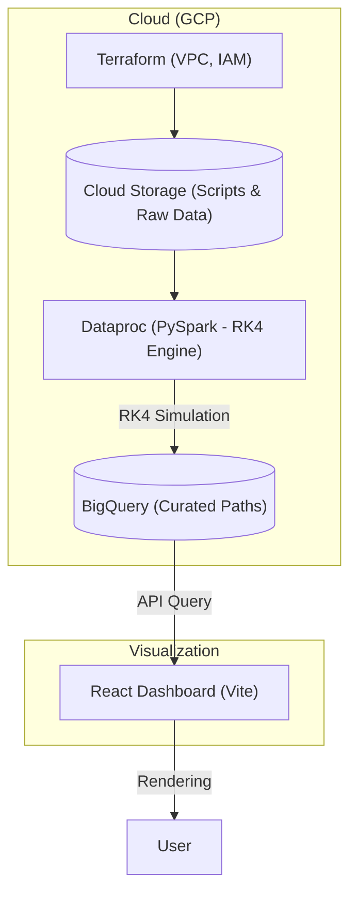

# 🌑 Black Hole Visualizer

This project leverages the power of **Google Cloud Platform** to simulate and render light distortion (gravitational lensing) caused by black holes, using the **Schwarzschild metric** and advanced numerical methods.

## 🎯 Objective
Create a platform capable of processing millions of geodesics (light paths) in a distributed manner, storing the results for real-time interactive rendering.

---

## 🏗️ General Architecture



---

## 🗺️ Project Roadmap

### **Phase 1: Infrastructure (Completed) ✅**
- Deployment of VPC network and Cloud NAT.
- Terraform modules for GCS, BigQuery, and Dataproc.
- Automation scripts:
    - `init.sh`: Full project bootstrap (includes automatic API enablement).
    - `sync-project.sh`: Bulk synchronization of identifiers (Project ID, Region, Buckets) across the configuration.
    - `audit.sh`: Quick report of active resources.
    - `costs.sh`: Monthly cost estimation.
- Management VM configuration with static IP.

### **Phase 2: Simulation Engine (In Progress) 🛠️**
- Implementation of the **RK4 (Runge-Kutta 4th Order)** integrator.
- Transformation of Boyer-Lindquist coordinate components to Cartesian.
- Workload distribution using **PySpark** on Dataproc.

### **Phase 3: Data Pipeline**
- Simulation result ingestion into BigQuery.
- Schema optimization for fast light particle queries.

### **Phase 4: Visualization and Interface**
- Interactive Dashboard development in React.
- Simplified client-side ray-tracing implementation based on BigQuery data.

### **Phase 5: Optimization and Launch**
- Stress tests with millions of photons.
- Final cleanup for Open Source publication.

---

## 🚀 Quickstart Guide

### 1. Initialization (Bootstrap)
Prepare the GCP project, create the state bucket, and the administrative service account:
```bash
bash terraform/scripts/init.sh [PROJECT_ID] [STATE_BUCKET] [REGION] [USER_EMAIL]
```

### 2. Identifier Synchronization
If you need to change project or region in the future, use the synchronization script:
```bash
bash terraform/scripts/sync-project.sh [PROJECT_ID] [STATE_BUCKET] [REGION] [USER_EMAIL]
```

### 3. Infrastructure Deployment
Consult the detailed instructions in the Terraform folder for module deployment:
👉 [**Infrastructure Instructions (Terraform)**](./terraform/README.md)

---

## 🛠️ Technologies Used

- **Infrastructure**: Terraform, GCP (Dataproc, BigQuery, GCS, GCE).
- **Automation**: Bash scripting (Init, Sync, Audit, Costs).
- **Processing**: Python, PySpark.
- **MathematiCS**: RK4 Integration, Schwarzschild Metric.
- **Frontend**: React, Vite, Nginx.

---
*Exploring the event horizon with big data and automation.*
