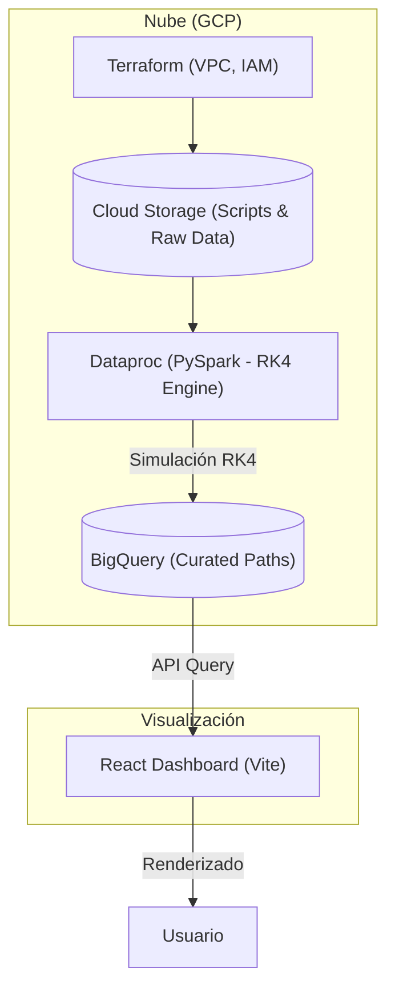

# 🌑 Black Hole Visualizer

Este proyecto utiliza la potencia de **Google Cloud Platform** para simular y renderizar la distorsión de la luz (lentes gravitatorias) causada por agujeros negros, utilizando la métrica de **Schwarzschild** y métodos numéricos avanzados.

## 🎯 Objetivo
Crear una plataforma capaz de procesar millones de geodésicas (trayectorias de luz) de forma distribuida, almacenando los resultados para un renderizado interactivo en tiempo real.

---

## 🏗️ Arquitectura General

---

## 🗺️ Roadmap del Proyecto

### **Fase 1: Infraestructura (Completado) ✅**
- Despliegue de red VPC y Cloud NAT.
- Módulos de Terraform para GCS, BigQuery y Dataproc.
- Scripts de automatización: `init.sh`, `audit.sh`, `costs.sh`.
- Configuración de VM de gestión con IP estática.

### **Fase 2: Motor de Simulación (En progreso) 🛠️**
- Implementación del integrador **RK4 (Runge-Kutta 4th Order)**.
- Transformación de coordenadas de coordenadas de Boyer-Lindquist a Cartesianas.
- Distribución de carga de trabajo mediante **PySpark** en Dataproc.

### **Fase 3: Pipeline de Datos**
- Ingesta de resultados de simulación en BigQuery.
- Optimización de esquemas para consultas rápidas de partículas de luz.

### **Fase 4: Visualización e Interfaz**
- Desarrollo del Dashboard interactivo en React.
- Implementación de ray-tracing simplificado en el cliente basado en la data de BigQuery.

### **Fase 5: Optimización y Lanzamiento**
- Pruebas de estrés con millones de fotones.
- Limpieza final para publicación Open Source.

---

## 🚀 Guía de Inicio Rápido

Para desplegar la infraestructura base, consulta la documentación en la carpeta de Terraform:

👉 [**Instrucciones de Infraestructura (Terraform)**](./terraform/README.md)

---

## 🛠️ Tecnologías Utilizadas

- **Infraestructura**: Terraform, GCP (Dataproc, BigQuery, GCS, GCE).
- **Procesamiento**: Python, PySpark.
- **Matemáticas**: RK4 Integration, Schwarzschild Metric.
- **Frontend**: React, Vite, Nginx.

---
*Explorando el horizonte de sucesos con datos masivos.*
