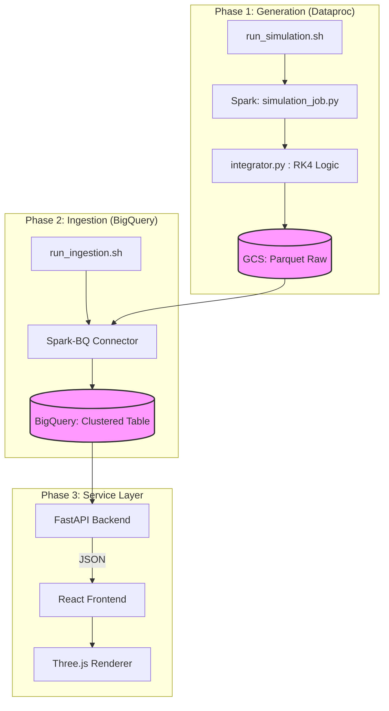

# Black Hole Visualizer Documentation

This directory contains the technical documentation and architectural diagrams for the Schwarzschild Black Hole Visualizer.

## Architectural Flow (Quick Preview)

Below is a Mermaid representation of the data lifecycle. For the ultra-detailed version, open [architecture_flow.drawio](./architecture_flow.drawio) in [draw.io](https://app.diagrams.net/).

### Data Pipeline Details

1.  **Generation**: Relativistic geodesics are calculated using parallelized Spark tasks. Each photon's path is solved using a 4th-order Runge-Kutta integrator.
2.  **Storage**: High-volume spatial data is stored in Parquet (GCS) for cost-efficiency and then indexed in BigQuery clustered by `photon_id` for sub-second query performance.
3.  **Visualization**: The frontend uses `BufferGeometry` to handle large arrays of photon coordinates, rendering interactive 3D trajectories with post-processing bloom.
